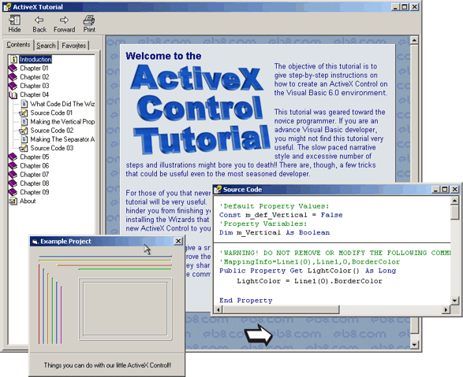



## \_\ActiveX Control Tutorial Part 3 of 3

### Description

This is the 3rd part of a 3 parts download. The tutorial has gotten pretty big (1.2 MB)! For this reason, I had to compress it with WinRAR and split the file into 3 smaller files. First, you will have to download the three files. The files' size must be 427 KB, 432 KB and 431 KB respectively. If the size of one of the files does not correspond to the mentioned values, download that file again. After that, decompress their content into the same folder and run the EXE file. I know that it is a little complicated but I’m sure that you will not regret downloading it!!

----

If you never had the chance to program an ActiveX Control before, that is your chance! You have no more excuses! This tutorial has about 25 pages packed with more then 60 screenshots!! Even the most novice programmer will be able to follow the step-by-step instructions. The more advanced programmers will, also, benefit from it. But there is more!! Included is an ActiveX Control Project that is, by itself, worth the download!! You shouldn’t waist more time!! Come and download it!!

----

When you are finished downloading and evaluating the tutorial, I will be more than glad to receive your comments and votes. But when you do it, please, make sure that you are in the THIRD and last part of the submission.

----

Happy New Year to everyone!!
 
### More Info
 

             |
---                |---
**Submitted On**   |2004-01-02 05:56:32
**By**             |[Elias Barbosa](https://github.com/Planet-Source-Code/PSCIndex/blob/master/ByAuthor/elias-barbosa.md)
**Level**          |Beginner
**User Rating**    |4.9 (271 globes from 55 users)
**Compatibility**  |VB 6\.0
**Category**       |[OLE/ COM/ DCOM/ Active\-X](https://github.com/Planet-Source-Code/PSCIndex/blob/master/ByCategory/ole-com-dcom-active-x__1-29.md)
**World**          |[Visual Basic](https://github.com/Planet-Source-Code/PSCIndex/blob/master/ByWorld/visual-basic.md)
**Archive File**   |[ActiveX\_Co168948122004\.zip](https://github.com/Planet-Source-Code/elias-barbosa-font-color-red-activex-control-tutorial-part-3-of-3__1-50732/archive/master.zip)

